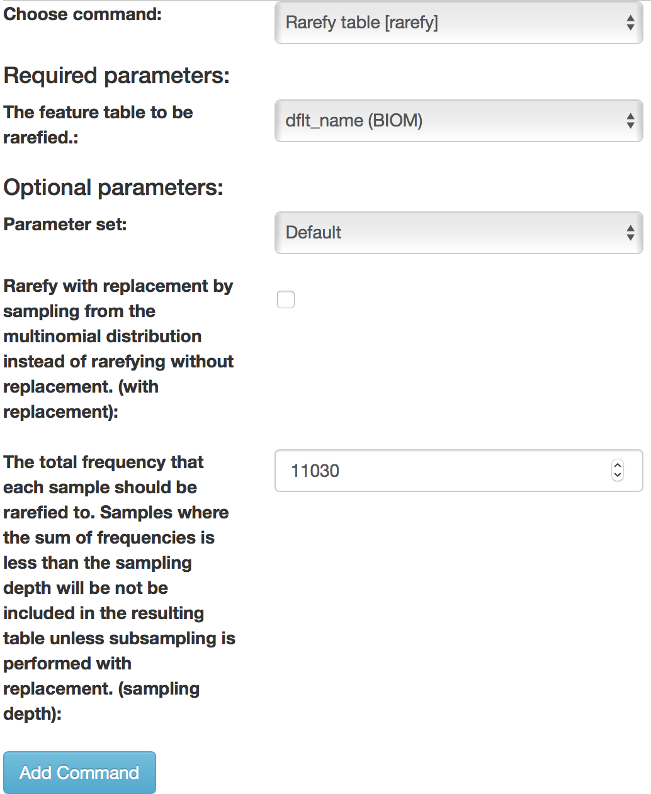
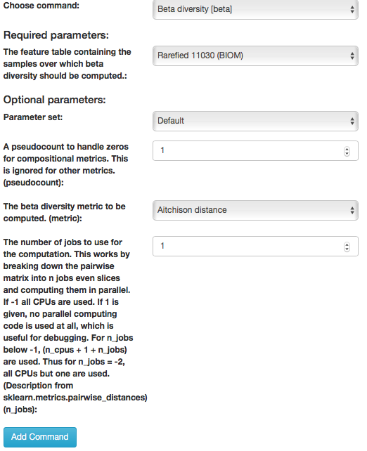
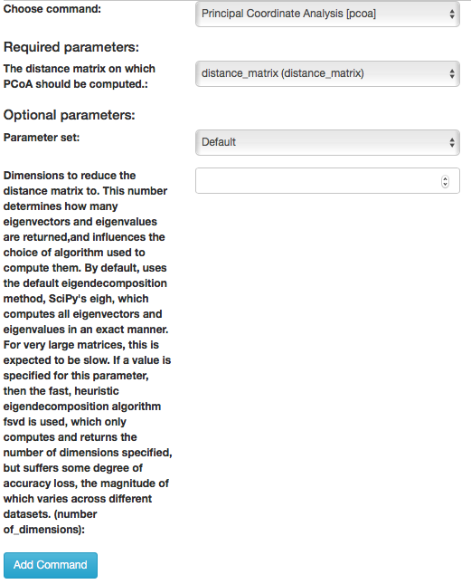
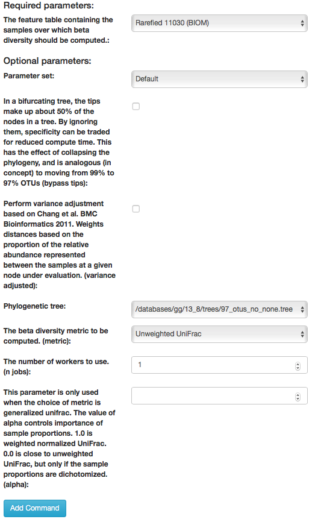
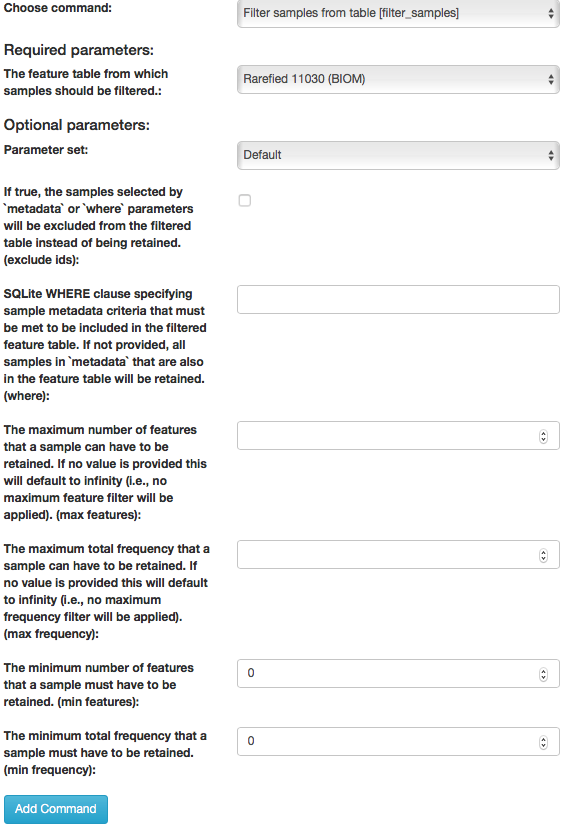

Analysis of Closed Reference Process
------------------------------------

To create an analysis, select "Create new analysis" from the top menu.

This will take you to a list of studies with samples available to you for
analysis, divided between your studies and publicly available studies ("Public Studies").

.. figure::  images/analysis_studies_page3.png
   :align:   center

Find the "CMI workshop analysis" study in Public Studies. You can use the search window at the top right, or filter by tags ("CMIWorkshop" tag).
Click the green plus sign at the left of the row. This will expand the study to expose all
the objects from that study that are available to you for analysis.

.. figure::  images/study_expanded3.png
   :align:   center

To look more closely at the details of the artifact, select "Per Artifact (1)." Here you can add each of these objects to the analysis by selecting the “Add” button. We will just add the Closed Reference OTU table object by clicking “Add” in that row.

.. figure::  images/your_study3.png
   :align:   center

Now, the second-right-most icon at the top bar should turn green, indicating that there are samples selected for analysis.

.. figure::  images/clipboard.png
   :align:   center

Clicking on the icon will take you to a page where you can refine the samples you want to include in your analysis. Here, all 30 of our samples are currently included:

.. figure::  images/selected_samples2.png
   :align:   center

You could optionally exclude particular samples from this set by clicking on
"Show/Hide samples", which will show each individual sample name along with a
"remove" option. (Removing them here will mask them from the analysis, but will
not affect the underlying files in any way.)

This should be good for now. Click the "Create Analysis" button, enter a name and
description, then click "Create Analysis".

.. figure::  images/create_analysis_button2.png
   :align:   center

This brings you to the processing network page. Here, pulling down the “Processing Network” tab. This may take 2 to 5 minutes to load. You can analyze data that has been run.

.. figure::  images/processing_network_photo4.png
   :align:   center

Before we process the data, let's have a look at the summary of the contents of the biom file. Select the "dflt_name (BIOM)" artifact to see a summary of this file displaying a table summary, details regarding the frequency per sample, histogram of the number of features per sample:

.. figure::  images/summaryinfo.png
   :align:   center

As you can see, this file contains 30 samples with roughly 36,000 features. The features in our case are OTUs (Operational Taxanomic Units), because the features were generated using the closed-reference OTU picking.

.. admonition:: Question
    
    Are OTUs equivalent to bacterial species? Please, provide a justification to your answer.  
    You may find the `Qiita glossary <https://qiita.ucsd.edu/static/doc/html/glossary.html>`__ useful.

Now we can begin analyzing these samples. Let’s go ahead and select "dflt_name (BIOM)" then select “Process”. This will take us to the commands selection page. Once there, the commands pull down tab can be accessed which will display twenty-five actions.

.. figure::  images/command_options4.png
   :align:   center

The text in brackets is the actual underlying commands from QIIME2. We will now go through the use of some of the most-used commands which will enable you to generate summaries, plot your data, and calculate statistics to help you get the most out of your data.

Rarefying Data
--------------

For certain analyses such as those we are about to conduct, the data should be *rarefied*. This means that all the samples in the analysis will have their features, in this case OTUs, randomly subsampled to the same, desired number, reducing potential alpha and beta diversity biases. Samples with fewer than this number of features will be excluded, which can also be useful for excluding things like blanks. To choose a good cutoff for your data, view the histogram that was made when we generated the summary of the data.

.. figure::  images/histogram2.png
   :align:   center

An appropriate cutoff would exclude clear outliers, but retain most of the samples. Here we have already removed blanks from our data and eliminated the outliers prior to analysis so we will just use the minimum number of features observed in our samples (11030) as the cutoff.

To rarefy the data, select "Rarefy table" from the drop-down menu. The parameters will appear below the workflow diagram:

Several parameters will have only one option which will be automatically selected for you. In the field, "The total frequency that each sample should be rarefied to...(sampling depth)", we will specify the number of features to rarefy our samples to. Enter "11030" in this box, and click "Add Command".

.. figure::  images/rarify_parameter_with_sampling_depth3.png
   :align:   center

Click the "Run" button above the workflow network to start the process of rarefaction. Then, click on the "dflt_name (BIOM)" artifact to see blue "Jobs using this data" button. Once you click on it, you can see the current status of your job. You can also view it clicking on the server button in the top-right corner of the screen:

.. figure::  images/server.png
   :align:   center

The view will return to the original screen, while the rarefied feature-table generation job runs. Your browser wil automatically refresh every 15 seconds until the "rarefied table (BIOM)" artifact appears:

.. figure::  images/rarify_workflow4.png
   :align:   center

Select the newly generated "rarefied_table (BIOM)" artifact. This time instead of seeing a histogram of the rarefied samples, you instead see a brief summary confirming that your samples have all be rarefied to the same depth. Now that the data are rarefied, we can begin the analysis.

Taxa Bar Plots
--------------

.. admonition:: NOTE
    
    Taxonomy is outside the scope of this lab session. However, if you are interested in this topic, you are encouraged to follow the `CMI Qiita/GNPS tutorial <https://cmi-workshop.readthedocs.io/en/latest/qiita-16S-analysis.html#taxa-bar-plots>`__ **afterwards**. 

Alpha Diversity Analysis
------------------------

Now, let's analyze the alpha diversity of your samples. Alpha diversity metrics describe the diversity of features within a sample or a group of samples. This is used to analyze the diversity within rather than between samples or a group of samples.

Observed Operational Taxonomic Units
~~~~~~~~~~~~~~~~~~~~~~~~~~~~~~~~~~~~

One type of analysis for alpha diversity, and the simplest, is looking at the number of observed, unique features, or OTUs in this example, also known as feature richness. This type of analysis will provide the number of unique OTUs found in a sample or group of samples.

To perform an alpha diversity analysis of feature richness, select the rarefied "rarefied table (BIOM)" artifact in the processing network and select "Process". Select "Alpha diversity" from the drop-down menu. The parameters will appear below the workflow diagram:

.. figure::  images/observed_OTU_parameter4.png
   :align:   center

Several parameters have been automatically selected for you since these options cannot be changed. In the field, "The alpha diversity metric... (metric)", we will specify the alpha diversity metric to run in our analysis. Select "Number of distinct features" from the drop-down menu in this box, and click "Add Command".

Once the command is added the workflow should appear as follows:

.. figure::  images/observed_OTU_workflow4.png
   :align:   center

Click the run button to start the process of the alpha diversity analysis. The view will return to the original screen, while the alpha diversity analysis job runs.

Faith's Phylogenetic Diversity Index
~~~~~~~~~~~~~~~~~~~~~~~~~~~~~~~~~~~~

Another alpha diversity analysis in this tutorial uses Faith’s phylogenetic diversity index. This index also measured abundance and diversity but considers the phylogenetic distance spanning all features in a sample. The results can also be displayed as a phylogeny, rather than as a plot.

To perform an alpha diversity analysis using Faith's phylogenetic diversity index, select the "rarefid table (BIOM)" artifact in the processing network and select "Process". Select "Alpha diversity (phylogenetic)" from the drop-down menu. The parameters will appear below the workflow diagram:

.. figure::  images/faith_pd_parameter4.png
   :align:   center

Several parameters have been automatically selected for you. For example, in the field, "The alpha diversity metric... (metric)", "Faith's Phylogenetic Diversity" has already been chosen from the drop-down menu in this box. In the "Phylogenetic tree" field select "/databases/gg/13_8/trees/97_otus_no_none.tree" then click "Add Command".

Once the command is added the workflow should appear as follows:

.. figure::  images/faith_pd_workflow4.png
   :align:   center

Click the run button to start the process of the alpha diversity analysis. The view will return to the original screen, while the alpha diversity analysis job runs.

Alpha Diversity Outputs
~~~~~~~~~~~~~~~~~~~~~~~

Each alpha diversity analysis will output an interactive boxplot that shows how that alpha diversity metric correlates with different metadata categories:

.. figure::  images/alpha_diversity_boxplot.png
   :align:   center

To change the category, choose the "Category" pull-down menu and choose the metadata category you would like to analyze:

.. figure::  images/alpha_diversity_categories.png
   :align:   center

You will also be given the outcomes to Kruskal-Wallis tests:

.. figure::  images/Kruskal_Wallis.png
   :align:   center

.. admonition:: Question

    Which alpha diversity metric produces a higher between-subject effect size?

Beta Diversity Analysis
-----------------------

One can also measure beta diversity in Qiita. Beta diversity measures feature turnover among samples (i.e., the diversity between samples rather than within each sample). This is used to compare samples to one another.

Bray-Curtis Dissimilarity
~~~~~~~~~~~~~~~~~~~~~~~~~

One commonly used beta diversity metric is Bray-Curtis dissimilarity. This metric quantifies how dissimilar samples are to one another.

To perform an anlaysis of beta diversity using the Bray-Curtis dissimilarity metric, select the "rarefied table (BIOM)" artifact in the processing network and select "Process". Then select "Beta diversity" from the drop-down menu. The parameters will appear below the workflow diagram:

Several parameters have been automatically selected for you. In the field, "The beta diversity metric... (metric), we will specify the beta diversity analysis to run. Select "Bray-Curtis dissimilarity" from the drop-down menu in this box, and click "Add Command".

To create a principal coordinates plot of the Bray-Curtis dissimilarity distance matrix, select the "distance matrix (distance matrix)" artifact and select "Process". Select "Perform Principal Coordinate Analysis (PCoA)" from the drop-down menu. The parameters will appear below the workflow diagram:

All of the parameter have automatically selected for you just click "Add Command".

Once the command is added the workflow should appear as follows:

.. figure::  images/bray_curtis_workflow4.png
   :align:   center

Click the run button to start the process of the beta diversity analysis. The view will return to the original screen, while the beta diversity analysis job runs.

Unweighted UniFrac Analysis
~~~~~~~~~~~~~~~~~~~~~~~~~~~

Another commonly used distance metric for measuring beta diversity is unweighted UniFrac distance. *Unweighted* refers to that the metric considers only feature richness and not abundance, when comparing samples to one another. This differs from the weighted UniFrac distance metric, which takes into account both feature richness and abundance, for each sample.

To perform unweighted UniFrac analysis, select the "rarefied table (BIOM)" artifact in the processing network and select "Process". Then select "Beta diversity (phylogenetic)" from the drop-down menu. The parameters will appear below the workflow diagram:

All of the parameters have been automatically selected for you, just click "Add Command".

To create a principal coordinates plot of the unweighted Unifrac distance matrix, select the "distance_matrix (distance_matrix)" artifact that will be generated using Unweighted UniFrac distance. Note that, unless you rename each distance matrix (see below: Altering Workflow Analysis Names), they will appear identical until you select them to view their provenance information. Once you have selected the distance matrix artifact, select "Perform Principal Coordinate Analysis (PCoA)" from the drop-down menu. The parameters will appear below the workflow diagram:

.. figure::  images/unweighted_pcoa4.png
   :align:   center

All of the parameters have been automatically selected for you just click "Add Command". Once the command is added the workflow should appear as follows:

.. figure::  images/unweighted_workflow4.png
   :align:   center

Click the run button to start the process of the beta diversity analysis. The view will return to the original screen, while the beta diversity analysis job runs.

.. admonition:: Question

    Is there a scenario in which unweighted UniFrac value can be < 0?
    Which of the two distance metrics used produces more homogenous results (eg. smaller variance)?

Principal Coordinate Analysis
~~~~~~~~~~~~~~~~~~~~~~~~~~~~~

Clicking on the "pcoa (ordination_results)" (Principal Coordinate Analysis) artifact will open an interactive visualization of the similarity among your samples. Generally speaking, the more similar the samples with respect to their features, the closer the are likely to be in the PCoA ordination plot. The Emperor visualization program offers a very useful way to explore how patterns of similarity in your data associate with different metadata categories.

Once the Emperor visualization program loads, the PCoA result will look like:

.. figure::  images/full_pcoa2.png
   :align:   center

You will see tabs including "Color", "Visibility", "Opacity", "Scale", "Shape", "Axes", and "Animations".

Under "Color" you will notice two pull-down menus:

.. figure::  images/color_tab2.png
   :align:   center

Under "Select a Color Category" you can select how the samples will be grouped. Under "Classic QIIME Colors", you can select how each group will be colored.

Under the "Visibility" tab you will notice 1 pull-down menu:

.. figure::  images/visibility_tab2.png
   :align:   center

Under "Select a Visibility Category" you can select which group will be displayed on the PCoA plot.

Under the "Opacity" tab you will notice 1 pull-down menu:

.. figure::  images/opacity_tab.png
   :align:   center

Under "Select an Opacity Category" you can select the categories in which the opacity will change on the PCoA plot. Once chosen, these groups will be displayed under "Global Scaling" and, when selected, you can change the opacity of each group separately. 
Under "Global Scaling" you can change the opacity of all of the samples.

Under the "Scale" tab you will notice 1 pull-down menu:

.. figure::  images/scale_tab2.png
   :align:   center

Under "Select a Scale Category" you can choose the grouping of your samples. Under "Global Scaling" you can change the point size for each group on the PCoA plot.

Under the "Shape" tab you will notice 1 pull-down menu:

.. figure::  images/shape_tab2.png
   :align:   center

Under "Select a Shape Category" you can alter the shape of each group on the PCoA plot to the following:

.. figure::  images/shape_options.png
   :align:   center

Under the "Axis" tab you will notice 5 pull-down menus:

.. figure::  images/axis_tab2.png
   :align:   center

The first 3 pull-down menus located under "Visible" allow you to change the axis that are being displayed.
The "Axis and Labels Color" menu allow you to change the color of your axis and label of the PCoA.
The "Background Color" menu allows you to change the color of the background of the PCoA.
The % Variation Expanded graph displays how different the most dissimilar samples are by percentage for each axis that can be used.

Under the "Animations" tab you will notice 2 pull-down menus:

.. figure::  images/animations_tab.png
   :align:   center

Under "Category to sort samples" you can choose the category that you will be sorting the samples by. Under "Category to group sample" you can choose the category that you will be grouping the samples by.

Let’s take a few minutes now to explore the various features of Emperor. Open a new browser window with the `Emperor tutorial <https://biocore.github.io/emperor/tutorial_index.html#section1>`__ and follow along with your test data.

.. admonition:: Question

    From the unweighted UniFrac PCoA plot, what is the main driver of bacterial community separation, subject (`host_subject_id`), body side (`side`), or phase of the experiment (`phase_discreet`)?
    Is the same true for Bray-Curtis results?

Beta Diversity Group Significance
~~~~~~~~~~~~~~~~~~~~~~~~~~~~~~~~~

Another way to study the beta diversity is by measuring the beta diversity group significance. Beta diversity group significance measures whether groups of samples are significantly different from one another using a permutation-based statistical test. Sample groups are designated by metadata variables.

If you have completed the tutorial up to this point, you can begin analysis of beta diversity group significance from one of your beta diversity distance matrices (jump down two paragraphs). Here we begin with the rarefied feature-table. To perform a beta group significance analysis, select the "rarefied table (BIOM)" artifact in the processing network and select "Process". Select "Beta diversity" from the drop-down menu. The parameters will appear below the workflow diagram:

.. figure::  images/beta_group_significance_beta4.png
   :align:   center

Several parameters have been automatically selected for you. In the field, "The beta diversity metric... (metric)", we will specify the beta diversity distance metric to use in our analysis. Note that if you attempt to create a distance matrix that already exists in the Processing network, you will get an error stating such. For example, if you have already created a beta diversity distance matrix using the Bray-Curtis dissimilarity metric, you will have to select a unique metric here (e.g., "Aitchison distnace"). In the "Phylogenetic tree" field enter "/databases/gg/13_8/trees/97_otus.tree", and click "Add Command".

To create the beta group significance analysis, select the "distance_matrix (distance_matrix)" artifact of interest in the Processing network, and select "Beta diversity group significance" from the drop-down menu. The parameters will appear below the workflow diagram:

.. figure::  images/significance_matrix4.png
   :align:   center

Several parameters have been automatically selected for you. In the "Metadata column to use" field we will specify the category from the metadata file to be used for determining significance between groups (e.g., subject). Using the "Perform pairwise tests..." checkbox we can indicate if we would like the group significance to be run "Pairwise", otherwise the analysis will be done across all groups (i.e., Non-pairwise). Note that for metadata variables for which there are only two groups, this distinction makes no difference. In the field, "The group significance test... (method)", we will specify the correlation test that will be applied (e.g., `PERMANOVA [Permutational multivariate analysis of variance] <http://onlinelibrary.wiley.com/doi/10.1111/j.1442-9993.2001.01070.pp.x/full>`__). Then click "Add Command". Once the command is added the workflow should appear as follows:

.. figure::  images/beta_group_significance_workflow4.png
   :align:   center
   
Click the run button to start the process of the beta diversity group significance analysis. The view will return to the original screen, while the beta diversity group significance analysis job runs.

Beta Group Significance Output Analysis
^^^^^^^^^^^^^^^^^^^^^^^^^^^^^^^^^^^^^^^

Once the beta group significance "visualization (q2_visualization)" artifact is chosen in the network, the beta diversity group significance Overview, which in our case shows results from the PERMANOVA (i.e., across all groups) and Group significance plots will appear:

.. figure::  images/beta_significance_overview.png
   :align:   center
   
.. figure::  images/beta_significance_boxplot2.png
   :align:   cemter

The results from pairwise PERMANOVA tests will also be displayed if included in the analysis:

.. figure::  images/permanova_results2.png
   :align:   center
   
The command 'Beta diversity group significance' provides PERMANOVA that can be run on a single categorical metadata variable. If you instead would like to provide multiple terms in the form of an equation, you can use the command 'adonis PERMANOVA test for beta group significance'. This latter command implements the 'adonis' function from the R package, vegan.

.. _referencefiltering:

.. admonition:: NOTE

    The sections below are **optional**. You can do them only if you have the time.

Filtering Data
--------------

Using QIITA you can also filter your data. This allows you to filter out samples.

To filter the data, select the "rarefied table (BIOM)" artifact in the processing network and select "Process". Then select "Filter samples from table" from the drop-down menu. The parameters will appear below the workflow diagram:

Several parameters have been automatically selected for you. In the "SQLite WHERE-clause" field we are filtering out all samples except for certain samples. In this case we wanted to filter out all samples except those in which :code:`subject = 'Volunteer 3'`, and click "Add Command".
If instead you want to filter out all of Volunteer 3's samples, either use the SQLite WHERE-clause above while also checking the box "If true, the samples selected... will be excluded", or alternatively use the SQlite WHERE-clause :code:`subject != 'Volunteer 3'`, and click "Add Command". If you want to filter for samples containing an apostrophe, write it out in the following format: :code:`subject = \"Volunteer 3's samples\"`.
**Keep in mind that all fields are case sensitive**.

Click "Run" to execute the filtering process.

An example of how you can use filtering in your analysis is explained in the following "Filtered Unweighted UniFrac Analysis" section.

Filtered Unweighted UniFrac Analysis
------------------------------------

By filtering, you can perform unweighted UniFrac analysis but this time without certain sample.

After filtering your data (shown in the previous "Filtering Data" section), you can perform a beta diversity analysis by selecting the "filtered_table (BIOM)" in the Processing network and clicking "Process". Select "Beta diversity (phylogenetic)" from the drop-down menu. The parameters will appear below the workflow diagram:

All of the parameters have been automatically selected for you, just click "Add Command".

To create a principal coordinates plot of the unweighted Unifrac distance matrix, select the "distance_matrix (distance_matrix)" artifact that you set up above, and select "Perform Principal Coordinate Analysis (PCoA)" from the drop-down menu. The parameters will appear below the workflow diagram:

.. figure::  images/filtered_unweighted_pcoa4.png
   :align:   center

All of the parameters have been automatically selected for you just click "Add Command". Once the command is added the workflow should appear as follows:

.. figure::  images/filtered_unweighted_workflow4.png
   :align:   center

Click the run button to start the process of the beta diversity analysis. The view will return to the original screen, while the beta diversity analysis job runs.

Altering Workflow Analysis Names
--------------------------------

To alter the name of a result, click the artifact then use the edit button on the processing network page.

.. figure::  images/rename_data_on_workflow2.png
   :align:   center

This will cause a window to pop-up where you can input the name you’d like to replace it with.

.. figure::  images/rename_data_popup.png
   :align:   center